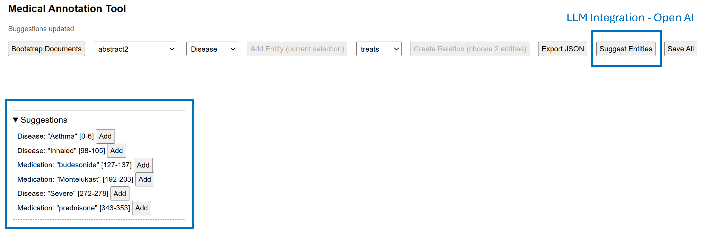

# Medical Entity and Relation Annotation Tool

This project is a web-based tool for medical experts to annotate medical entities and relationships in clinical narratives. The annotations can be exported for use in healthcare NLP model training and evaluation.

For deeper technical details (architecture, data model, extensibility), see [`docs/design.md`](docs/design.md).

## Live Demo (AWS App Runner)
Running instance (ephemeral demo environment):

UI: https://ifk8vjymp2.ap-southeast-2.awsapprunner.com/ui/

Health check: https://ifk8vjymp2.ap-southeast-2.awsapprunner.com/health

Note:
- Cold start right after a new deployment may take ~30–60s.
- LLM suggestions currently enabled (OpenAI key configured). Invoke: `/suggest/entities?doc_id=<id>&mode=llm` (UI button remains heuristic-only).

Evaluation format: A live, interactive environment is intentionally provided in place of static screenshots or a prerecorded video so reviewers can exercise the end‑to‑end workflow (bootstrap → annotate entities → create relations → suggestions → export) directly. A capture can be produced on request if offline evidence becomes necessary.

## Project Folder Structure

```
MedicalAnnotationTool/
│
├── backend/                      # FastAPI backend
│   └── app/
│       ├── main.py               # API + models + persistence + exports
│       └── suggestion_service.py # Heuristic + optional OpenAI suggestions
│   └── requirements.txt
│
├── frontend/                     # Static UI
│   └── index.html
│
├── data/
│   ├── raw/                      # Source text abstracts (.txt)
│   ├── annotations/              # Saved JSON annotations (generated)
│   └── vocab.json                # Controlled vocab
│
├── docs/
│   └── design.md                 # Architecture & data model
│
├── docker-compose.yml            # Local orchestration
├── Dockerfile                    # Container image build
├── .gitignore
└── README.md
```

## Quick Start (Local with Docker)

Prerequisites: Docker Desktop.

1. Clone the repository.
2. Build and start the backend container:
	```powershell
	docker compose up --build
	```
3. Verify health endpoint:
	```powershell
	curl http://localhost:8000/health
	```
4. Explore the autogenerated docs (FastAPI): http://localhost:8000/docs
5. (Optional UI) Open interface: http://localhost:8000/ui/
6. Load sample abstracts (first time only; POST or simple GET):
	```powershell
	curl -X POST http://localhost:8000/bootstrap
	# or
	curl http://localhost:8000/bootstrap
	```
7. Explore the controlled vocabulary: http://localhost:8000/vocab
8. List loaded documents:
	```powershell
	curl http://localhost:8000/documents
	```
9. (Optional) Get heuristic suggestions for a document:
	```powershell
	curl "http://localhost:8000/suggest/entities?doc_id=abstract1"
	```
10. (Optional) Stop containers:
	```powershell
	docker compose down
	```

## API Summary (Backend)
Endpoints:
- POST /documents
- GET /documents
- GET /documents/{id}
- POST /documents/{id}/entities
- POST /documents/{id}/relations
- GET /documents/{id}/export
- GET /export/all (aggregate export of all documents)
- POST /import (upload JSON export)
- GET /health
- GET /vocab (controlled entity/relation types)
- POST /bootstrap (ingest raw abstracts into documents)
- GET /suggest/entities (heuristic suggestions by default)
	- Optional query param `mode=llm` to use OpenAI model if `OPENAI_API_KEY` is set
- GET /export/entities.csv (flat entity CSV)
- GET /export/relations.csv (flat relation CSV)
- GET /export/all (aggregate JSON of all documents)
  
- POST /save/all (force save all documents)
- DELETE /documents/{id}/entities/{entity_id}
- DELETE /documents/{id}/relations/{relation_id}
- PATCH /documents/{id}/status (body: {"status":"completed" | "in_progress" | ...})

Example workflow (single document):
1. POST /bootstrap
2. GET /documents -> pick an id (e.g., abstract1)
3. Add entity:
	```powershell
	curl -X POST http://localhost:8000/documents/abstract1/entities ^
	  -H "Content-Type: application/json" ^
	  -d "{\"start\":0,\"end\":12,\"text\":\"Hypertension\",\"type\":\"Disease\"}"
	```
4. Create relation (needs two entity IDs — retrieve via GET /documents/{id}):
	```powershell
	curl -X POST http://localhost:8000/documents/abstract1/relations ^
	  -H "Content-Type: application/json" ^
	  -d "{\"source_entity_id\":\"<eid1>\",\"target_entity_id\":\"<eid2>\",\"relation_type\":\"treats\"}"
	```
5. Export annotated document:
	```powershell
	curl http://localhost:8000/documents/abstract1/export
	```

Persistence: documents auto-save to data/annotations/*.json after create, entity add, relation add, or import. To reload prior saved annotations instead of starting clean, call `/bootstrap?load_existing=true`.

## LLM-Assisted Suggestions (Optional)

You can augment the heuristic suggestions with an OpenAI model.

<p align="center">
	
</p>

Enable:
1. Obtain an OpenAI API key and set environment variable before starting the container:
	- PowerShell (temporary):
	  ```powershell
	  $env:OPENAI_API_KEY = "sk-..."
	  ```
	- Or add to docker compose / App Runner service env vars.
2. (Optional) Choose a model (default `gpt-4o-mini`):
	  ```powershell
	  $env:OPENAI_SUGGEST_MODEL = "gpt-3.5-turbo"
	  ```
3. Request suggestions with LLM mode:
	- `GET /suggest/entities?doc_id=abstract1&mode=llm`
   (Frontend button currently calls heuristic; invoke the above manually or via browser console.)

Behavior:
- If the LLM call fails (timeout / API error / malformed JSON) it falls back silently to heuristic and logs a one‑line fallback message.
- Suggestions include `source` (`openai` or `heuristic-*`) and `model` when from OpenAI.
- Force heuristic by omitting `mode` or using `mode=heuristic`.

Security / Cost Notes:
- Only entity suggestion endpoint uses the key; no key is stored in persisted documents.
- Keep request texts modest; abstracts are short so token usage remains low.

## Web UI Usage

Open http://localhost:8000/ui/ after the container is running. Then:

1. Click "Bootstrap Documents" to load sample abstracts (first run).
2. Choose a document from the drop-down.
3. Highlight text in the Document Text panel; click "Add Entity". It appears in the Entities list and is highlighted in the text.
4. To create a relation: check exactly two entity checkboxes, pick a relation type, click "Create Relation".
5. Click "Suggest Entities" to fetch heuristic suggestions; press "Add" on any suggestion to accept it.
	- LLM mode (if `OPENAI_API_KEY` is set) is currently triggered via API: open `/suggest/entities?doc_id=<id>&mode=llm` in the browser or use curl. UI button remains heuristic-only to keep it deterministic by default.
6. Click "Export JSON" to view the current document's raw annotation JSON in the Export panel.
7. Press "Save All" anytime to force persistence of all loaded documents (auto-save also happens on each add action).
8. Remove an entity or relation using the small ✕ button (after deletion re-select entities if creating a relation).

Status messages appear at the top; all saved JSON files land in `data/annotations/`.

## Sample Annotation JSON

Excerpt of a persisted document file (`data/annotations/abstract1.json`):

```json
{
	"id": "abstract1",
	"text": "Hypertension remains a leading cause of cardiovascular disease and stroke. Amlodipine, ...",
	"status": "in_progress",
	"entities": [
		{"id": "4195...46b9", "start":0, "end":12, "text":"Hypertension", "type":"Disease", "annotator": null, "timestamp": "2025-08-22T10:09:36.680464"},
		{"id": "eeca...2a98", "start":75, "end":85, "text":"Amlodipine", "type":"Medication", "annotator": null, "timestamp": "2025-08-22T10:09:38.476035"}
		// ... more entities ...
	],
	"relations": [
		{"id": "af84...261f", "source_entity_id": "4195...46b9", "target_entity_id": "eeca...2a98", "relation_type": "causes", "direction": "forward", "annotator": null, "timestamp": "2025-08-22T10:13:51.157282"},
		{"id": "73c5...be7f1", "source_entity_id": "eeca...2a98", "target_entity_id": "56b4...9e57", "relation_type": "treats", "direction": "forward", "annotator": null, "timestamp": "2025-08-22T10:18:43.106154"}
		// ... more relations ...
	]
}
```

(IDs truncated for readability.)

## Cloud Deployment (AWS App Runner)

The live demo runs on AWS App Runner (container direct from ECR). steps:

1. Build & tag image locally:
	- docker build -t annotation-tool:latest .
2. Push to ECR (create repo `annotation-tool` if needed) then tag & push.
3. In App Runner: Create service → Source: Amazon ECR → pick repository + tag `latest`.
4. Set port 8000 and environment variables:
	- APP_ENV=prod
	- APP_ANNOTATOR=demo (optional)
	- OPENAI_API_KEY=sk-*** (optional; add only if enabling LLM suggestions; store as secret, not in source)
	- OPENAI_SUGGEST_MODEL=gpt-4o-mini (optional override; defaults internally if unset)
5. Enable automatic deployments from ECR.
6. (Optional) Health check path /health.

Teardown: Delete App Runner service → (optional) delete ECR images/repository.

Cost / limits: Small size (1 vCPU / 2GB) keeps costs low; scale-out occurs automatically on load. No persistent volume attached—export data before redeploy.


